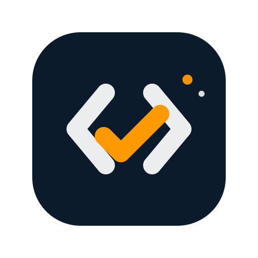

<div align="center">
  
  <h1><b>LearnCheck AI : Platform Evaluasi Belajar Cerdas & Adaptif</b></h1>
</div>

#### Unlock your true learning potential with AI-driven assessments.

**LearnCheck AI** adalah platform evaluasi pembelajaran berbasis Generative AI yang dirancang untuk membantu pengguna mengukur pemahaman materi secara mendalam. Aplikasi ini tidak hanya memberikan skor, tetapi juga menganalisis tingkat keyakinan (confidence level) untuk membedakan antara penguasaan materi yang murni dengan keberuntungan ("hoki"), serta menyediakan fitur aksesibilitas yang inklusif.

## Our Team

| Name | Bangkit-ID | Role |
| :--- | :--- | :--- |
| **Gericho Chandra Diva Pratama Hutagalung** | R429D5Y0684 | UI/UX & Styling |
| **Lucky Ferdiansyah** | R429D5Y1006 | React / Frontend Dev |
| **Mochammad Rifiq Surya Mulya Zarkasi** | R429D5Y1126 | Backend / AI Engineer |
| **M.Surya Dharma Khazinatul Azror** | R429D5Y1047 | Backend / AI Engineer |
| **Arya Leo Anggara** | R429D5Y0286 | React / Frontend Dev |

---

# Installation the App

## Prerequisites
Pastikan Anda telah menginstal software berikut sebelum memulai:
- [Node.js](https://nodejs.org/) (Versi 18+ direkomendasikan)
- [NPM](https://www.npmjs.com/) atau Yarn
- [Groq API Key](https://console.groq.com/) (Untuk backend AI)

## Getting Started

### 1. Setup Backend (Server)
Backend dibangun menggunakan Express.js dan bertugas menangani integrasi AI (Groq/Llama-3) serta scraping materi.

```bash
# Masuk ke folder backend (sesuaikan dengan struktur folder Anda)
cd backend

# Install dependencies
npm install

# Buat file .env dan isi konfigurasi berikut:
# GROQ_API_KEY=your_groq_api_key_here
# PORT=5000

# Jalankan Server
node index.js
